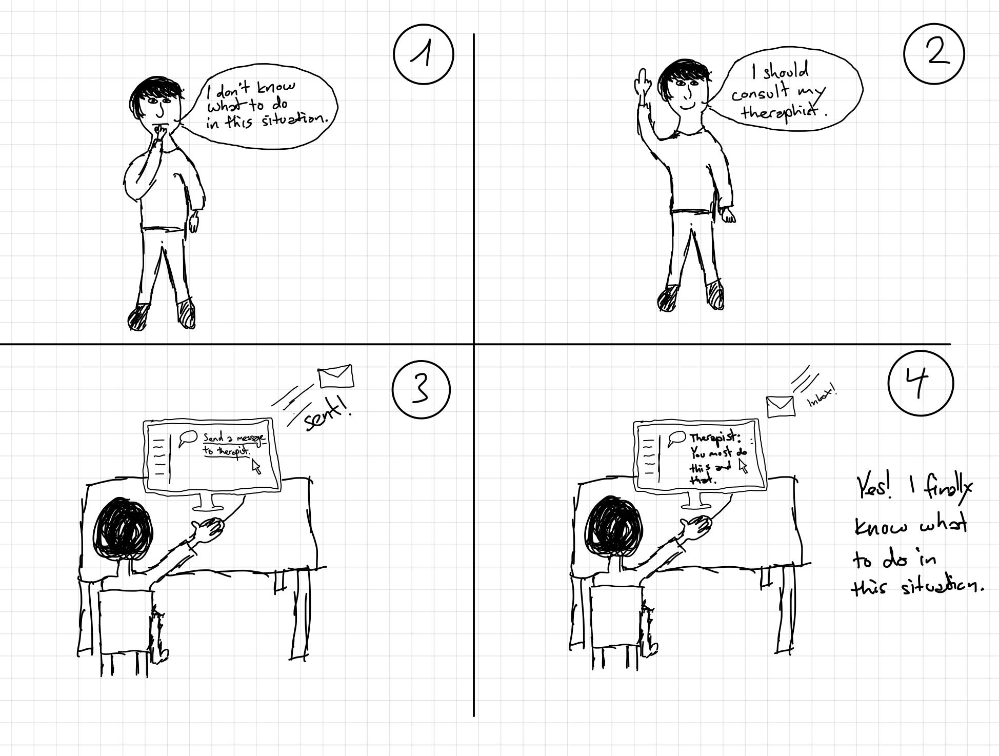
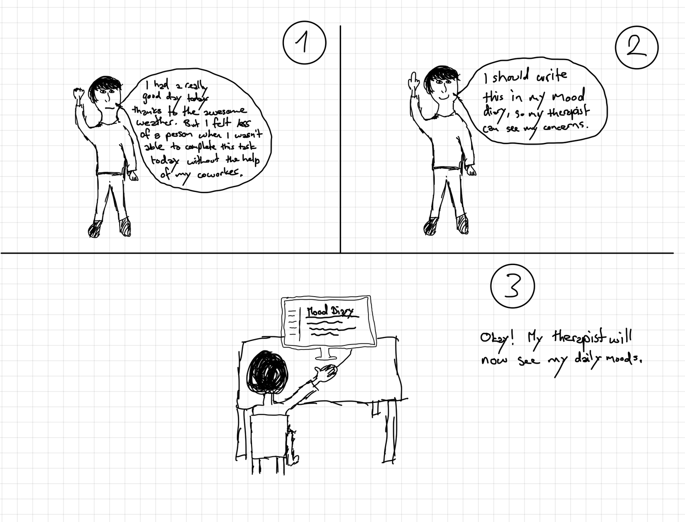
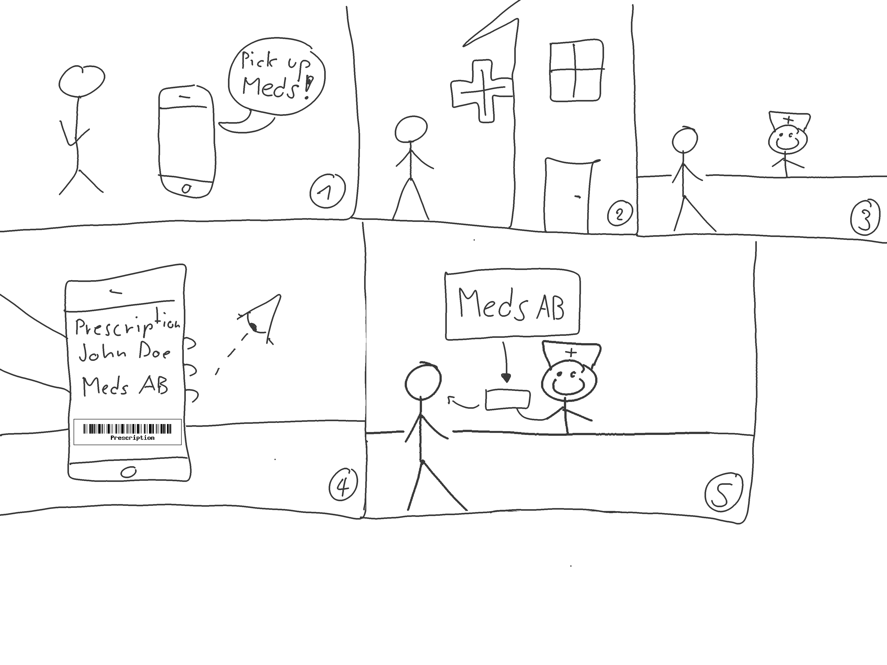
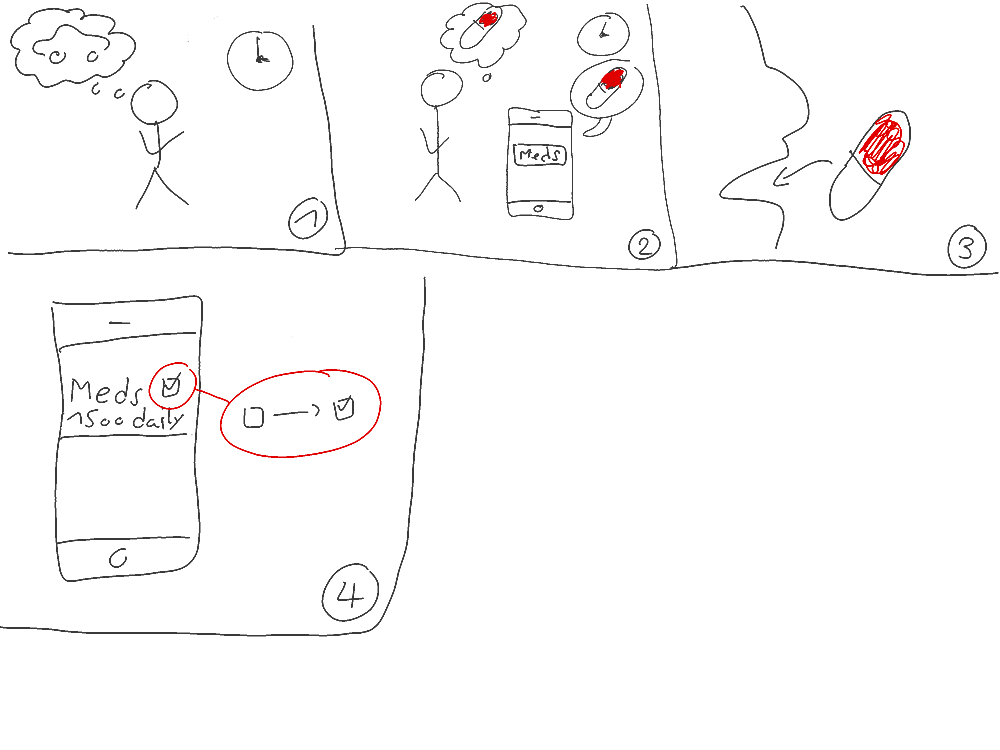
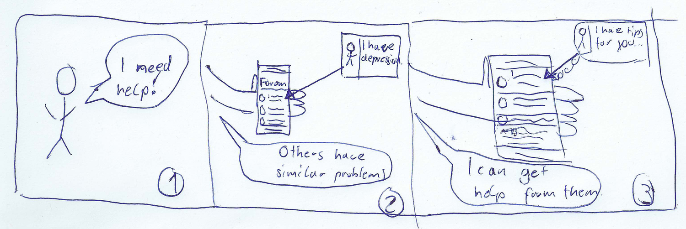
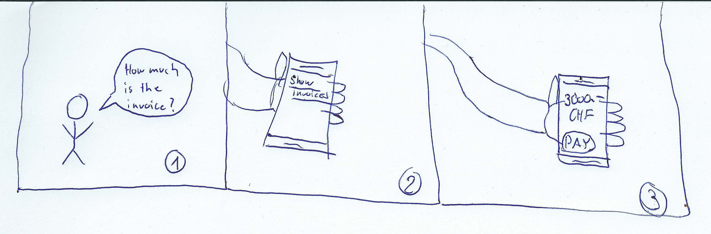

---
title: "Design Thinking"
subtitle: "Task 01 - Team Green"
author:
    - Fabio Caggiano
    - Christian Kocher
    - Marc Häsler
    - Marius Schär
    - Severin Kaderli
extra-info: false
rule-color: 00ba34
link-color: 00ba34
lang: "de-CH"
lof: true
...

# Scoping
## Unsere Aufgabe
Wir als Gruppe Grün haben die Aufgabe, eine Webapplikation aus Sicht eines (ambulanten) Patienten zu erstellen, der an Depression erkrankt ist. Dabei soll die Webapplikation schlussendlich dem Patienten helfen, alle relevanten Daten und Anforderungen an ihn besser managen zu können.

## Scope Definition
Wir haben uns folgende Stichworte zum Thema “Patient mit Depressionserkrankung” aufgeschrieben:

* Probleme
  * Suizidgefahr 
    * Notrufnummern/Hotline
  * Kein regelmässiges Einkommen
    * Öffentliche finanzielle Unterstützung
  * Mangelndes Wissen
    * Spezialist kontaktieren
    * Informationen über Probleme 
      * Suchmaschine
* Zerschlagenes familiäres Umfeld
  * Kontakte
* Therapie
  * Termine 
    * Erinnerung
    * Regelmässige Sitzung
  * Geschichte/Vergangenheit
* Medikation
  * Rezepte
* Versicherung 
  * Kostenübersicht
  * Rechnungen
* Depression 
  * Länge der Episoden > 2 Wochen
  * Symptome
    * Interessensverlust
    * Kein Selbstvertrauen
    * Schmerzen
    * Suizidgefährdet (10 – 14%)
    * Halluzinationen (selten
  * Behandlung 
    * Antidepressiva
    * Kognitives Verhalten Therapie
    * Zwischenmenschliche Therapie
* Features 
  * Medikamenten-Einnahme Erinnerung
    * Eingenommene Medikation abhaken
  * Ausgestellte Rezepte
  * Kommunikationsmöglichkeiten
    * Mit anderen Patienten (Selbsthilfe)
    * Chat mit Doktor
    * Notrufnummern-Übersicht
    * Suizid-Hotline
  * Dokumentenablage (sharing)
  * Tagebuch für den Patienten über seine Stimmung
  * Termine-Übersicht (Könnte der Patient Termine auch gleich über die App mit dem Therapeuten abmachen?)
  * Informationsseite zur Krankheit
  * Finanzielle Informationen (z.B. Versicherung)

# Research
## Informationssammlung
Die Informationen zum Thema Depression haben wir grösstenteils aus dem Interview mit [Herr Professor Florian Holsboer und der Helsana Krankenkasse](https://www.helsana.ch/de/blog/eine-depression-kann-aus-heiterem-himmel-kommen) gesammelt, um eine bessere Vorstellung der Krankheit zu bekommen. Darauf aufbauend haben wir Interviewfragen zusammengestellt, um das Patientenmanagementsystem (PMS) aus der Sicht eines (ambulanten) Patienten entwickeln zu können. 

Stichpunkte zum Thema Depression:

* Depression ist schwer zu quantifizieren, da sie nicht mit Laborwerten wie bei körperlichen Erkrankungen wie z.B. Diabetes nachweisbar ist.
* Depression wird durch winzige, unsichtbaren Mechanismen in den weitverzweigten Nervenkreisläufen des Hirns ausgelöst.
* Depression ist eine Hirnkrankheit, die einerseits aus Umwelteinflüssen wie Stress, Traumata in der Kindheit oder durch die Veranlagung der Eltern erworben werden kann. Äussere Einflüsse können auch die Aktivität unserer Gene verändern, auch Epigenetik genannt. Die DNA ist kein ruhiger Ort.
* Depression kann auch aus heiterem Himmel, was viele fälschlicherweise als Burnout bezeichnen, da diese sozialverträglicher ist.
* Man merkt, dass man eine Depression hat, wenn man ständig tieftraurig ist und sich nicht mehr an Dingen erfreut an denen man sich früher sehr wohl gefreut hat oder, wenn man sich seiner Familie und Freunden abwendet und einfach nur noch daran denkt, wie schlecht es einem geht.
* Um eine Depression diagnostizieren zu können, müssen zuerst andere Krankheiten ausgeschlossen werden, denn Antriebslosigkeit, Müdigkeit und negative Stimmung können auch von anderen Krankheiten wie Parkinson oder Alzheimer herrühren.
* Depression kann sich nicht von selbst heilen, deshalb stellt eine unzureichende oder gar keine Behandlung ein grosses Risiko für den Patienten dar. Die Depression könnte dauerhaft anhalten (Chronifizierung), was zu einer Frühinvalidität beim Patienten führen kann.
* Suizid ist eine schwere Folge der Depression. Das Abgestumpft-Sein, Nichts-mehr-Wollen, Nichts-mehr-Empfinden ist weit schlimmer als eine Operation – oder eine Krebserkrankung, laut einem Patienten, der schon all das durchgemacht hat.
* Depression ist also potenziell tödliche Krankheit, die jedes Jahr über eine Million Suizide weltweit auslöst. 
* Depressionen sollten mit Medikamenten in Kombination mit einer Gesprächstherapie behandelt werden. Die Kriterien sind bei allen Patienten gleich, nur die Ursache variiert von Patient zu Patient. Deshalb sollte jeder Patient individuell behandelt werden und die Medikamente auf den Patienten abgestimmt sein, denn nicht jedes Medikament wirkt bei jedem gleich.
* Heute ist es so, dass Psychiater aufgrund ihrer persönlichen Erfahrung und den bestimmten Symptomatiken, ein Medikament dem Patienten verschreiben. In Zukunft wird aber anhand der DNA vorausgesagt werden können, welche Medikamente den Patienten anspricht. Das ist der grosse Quantensprung in der psychiatrischen Behandlung.
* Eine Gesprächstherapie reicht vor allem bei Patienten mit schweren Depressionen nicht aus. Jeder Fünfte schwer Depressive ist nur teilweise heilbar, jeder Zehnte bleibt chronisch depressiv. Mit den heutigen Medikamenten werden zu wenig Patienten erfolgreich behandelt, da sie zu lange dauern bis sie wirken und auch zu viele Nebenwirkungen aufweisen.
* 10 – 14 Prozent erkranken der Bevölkerung erkrankt im Verlauf ihres Lebens an einer schweren Depression, dabei sind Männer und Frauen fast gleich betroffen. Es trifft vor allem die jüngeren Menschen und die Hauptursache für Frühinvalidät und Erwerbsunfähigkeit.
* Die Symptome einer Depression festzustellen ist im Gegensatz einer Knieverletzung schwieriger, weil das Gehirn erkrankt ist und man deshalb nicht gut über dessen Heilung nachsinnen kann. Wer Veränderungen spürt, sollte die die Symptome beim Hausarzt abklären lassen.
* Wenn bei einem Angehörigen Anzeichen einer Depression erkennt, sollte man ihm keinesfalls vorschlagen, auf eine schöne Reise zu gehen, da er ja seine Depression im Gepäck mitnimmt. Auch keine Vorwürfe wie «Reiss dich zusammen, dir geht’s doch gut, du hast doch alles, wieso bist du unzufrieden?» machen.
* Man sollte den jemand mit Depression offen fragen, ob ihn etwas bedrückt, da er nicht mehr so ist, wie man ihn kennt. Und ihn darauf aufmerksam machen, dass es etwas ist, das häufig vorkommt und es eine Krankheit wie jede andere ist. Dabei geht man wie bei jeder Krankheit auch zum Arzt, um nach Rat zu fragen und folgt bei Überzeugung dem Rat. Der Arzt sucht auch gleich das passende Therapieschema und die passende Medikation in Verbindung einer Gesprächstherapie.

## Interview 1
**Interviewpartner:** David Lieberherr (Arbeitsagoge)  
**Datum:** 26.03.2019  
**Ort:** Steinhölzli Bildungswege, 3097 Liebefeld

### Neue Patienten
#### Wie und wann werden Daten eines Patienten gespeichert?
Der Patient hat in der Regel eine Vorgeschichte. Der Therapeut erhält dabei alle Daten
des Vorgängers. 
#### Welche Informationen werden von einem neuen Patienten benötigt?
Welche Ziele mit dem Patienten bereits vom Vorgänger-Therapeuten vereinbart wurden oder
Resulte von Behandlungen oder ob der Patient irgendwelche schweren Krisen durchgemacht hat.
Im grossen und ganzen alle bereits existierenden Daten zum Patienten. 
#### Wie läuft eine erste Begutachtung eines Patienten ab?
Zuerst probiert man herauszufinden, ob die Chemie zwischen dem Patienten und Therapeuten überhaupt
stimmt. Der Patient muss sich nämlich auf den Therapeuten verlassen und ihm vertrauen können. Dann 
ist der Weg gut geebnet, um mit dem Patienten arbeiten zu können.

### Vorbereitung auf einen Termin mit einem depressionskranken Patienten
#### Wie bereitet sich ein Therapeut auf einen Termin mit einem Patienten vor?
Der Therapeut befasst sich intensiv mit der Geschichte des Patienten. Dabei müssen alle Krisen, die
der Patient hatte, wahrgenommen werden. Auch welche Ziele für den Patienten verfolgt werden sollen
und welche Medikamente für seine Probleme am besten geeignet sind.
#### Wie bereitet sich ein Patient auf den Termin vor, was wird von ihm verlangt?
Oft entwickelt der Therapeut zusammen mit dem Patienten einen "Anti-Stress-Koffer", also Methoden die
dem Patienten helfen sollen, mehr Gesundheit, Gelassenheit und Lebensfreude zu gewinnen. Der Patient
sollte deshalb die angewandten Methoden beurteilen können und vielleicht ein Tagebuch mitnehmen, das
beschreibt, ob ihm diese Methoden geholfen haben oder nicht. Wenn sie nichts gebracht haben, würde man 
andere Methoden ausprobieren. 
#### Wie machen Patienten Termine mit dem Therapeuten aus (Telefon, Mail, Online-Formular)?
Termine werden meistens telefonisch gemacht. Mails sind zu unpersönlich. Oft geht der Therapeut auch
zum Patienten nach Hause.
#### Haben Patienten Mühe, Termine einzuhalten?
Ja, Patienten haben eher Mühe, Termine einzuhalten.
* Warum haben sie Mühe?
Weil sie akute Phasen erleben. Patienten mit schweren Depressionen können/wollen meist gar nicht mehr 
das Bett oder das Zuhause verlassen.
* Wie könnte man Helfen, dass sie keine Mühe mehr haben?
Vereinbarungen mit dem Patienten treffen oder z.B. bei Krisenzeiten eine Meldung auf dem Smartphone anzeigen
lassen, dass er in diesem Moment einen bestimmte Betreuungsperson anrufen soll. Oder Skalierungsfragen
aufpoppen lassen, wie seine Stimmung momentan ist und aufgrund dessen Lösungen anbieten.

### Während dem Termin/Gespräch mit dem depressionskranken Patienten
#### Was sind die zu erwartenden Resultate eines Gesprächs?
* Was für Dokumentationen werden geführt (pers. Journal, Krankenakte/Patientendossier)?
Unterschiedliche Protokolle werden geführt, die schlussendlich alle in eine persönliche Akte des Patienten
gehen.
* Gibt es Anforderungen an die Art und Weise einer Dokumentation?
Therapeuten sind meistens in Berufsverbänden Mitglieder und diese Berufsverbände geben dann gewisse
Qualitätsanforderungen vor, woran sich Therapeuten halten müssen.
* Irgendwelche Anhänge wie Bilder/Audioaufnahmen/Video die erstellt werden?
Können auf jedenfall erstellt werde, einzige Bedingung ist die Einwilligung des Patienten. Auch für Therapeuten
gilt ärztliche Schweigepflicht.
* Gibt es eine strukturierte Vorgabe oder beruht alles auf Freitext?
Der Therapeut macht sich seine Notizen selber und kann sie strukturieren, wie er möchte, solange sie mit den 
Qualitätsanforderungen vereinbar sind.
* Darf der Patient Einblicke in die erstellte Dokumentation haben?
Ja, Akteneinsicht ist ein Recht des Patienten.

### Behandlungsablauf des Patienten
#### Auf was für Informationsquellen werden zugegriffen, um eine Diagnose zu erstellen?
* Wer meldete den Patienten?
Patienten weisen sich meistens selber ein. Kommt auch immer auf den Zustand des Patienten drauf an. Es gibt auch
Sorgentelefone, wo sich die Patienten melden können. Minderjährige werden durch ihren Vormund gemeldet.
* Wie wird es dokumentiert?
Diagnosen werden aufgrund der Standards der WTO (Weltgesundheitsorganisation) gemacht. Dort kann man bei bestimmten
Symptomen den Grad der Depression ablesen.
  
#### Wie werden Behandlungen ausgewählt und Erfolge überprüft?
Der Therapeut macht Vorschläge aufgrund des Krankheitbilds des Patienten und dann werden mit Zielen gearbeitet.
* Welche Faktoren sind relevant für die Dosierung/Rythmus einer Medikation?
Man fängt zuerst mit einer geringen Dosis an, um herauszufinden, wie der Körper und Geist darauf reagiert.
* Wie werden Daten zum Erfolg der Behandlung zusammengetragen?
In der Regel ist nur ein Therapeut beteiligt, und dieser führt eine Akte des Patienten, die nach und nach zu 
durch die Domumentierung zum Erfolg der Behandlung führen soll.

### Zur Patienten-App
#### Was ist Ihre Meinung zu den folgenden Features des Patienten-Apps?

* Medikamenten-Einnahme Erinnerung
    * Eingenommene Medikation abhaken
* Ausgestellte Rezepte
* Kommunikationsmöglichkeiten
    * Mit anderen Patienten (Selbsthilfe)
    * Chat mit Doktor
    * Notrufnummern-Übersicht
    * Suizid-Hotline
* Dokumentenablage (sharing)
* Tagebuch für den Patienten über seine Stimmung
* Termine-Übersicht (Könnte der Patient Termine auch gleich über die App mit dem Therapeuten abmachen?)
* Informationsseite zur Krankheit
* Finanzielle Informationen (z.B. Versicherung)

David Lieberherr: Im Grossen und Ganzen gefallen mir eure Ideen recht gut. Der Chat wird dem Patienten auch
das Gefühl geben können, dass er sich bei Fragen schnell beim Therapeuten melden kann. Hilfreich wäre
vielleicht auch noch, wenn ihr Skalierungsfragen einbauen könntet, die z.B. die aktuelle Stimmung von 1-10
aufzeigt. Aber sonst super Möglichkeiten, die die App bieten würde.

# Synthesize

# Design
## Storyboards Fabio Caggiano

## Storyboards Christian Kocher
## Storbyboards Marc Häsler
## Storbyboards Marius Schär

## Storbyboards Severin Kaderli

# Prototype

# Validate