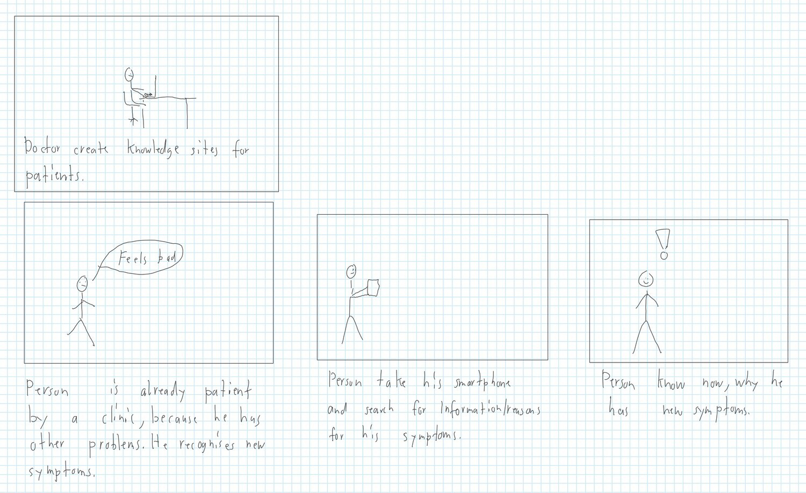
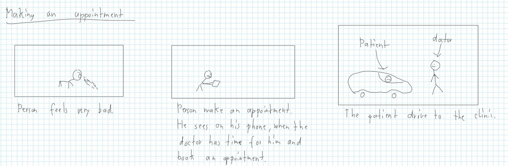
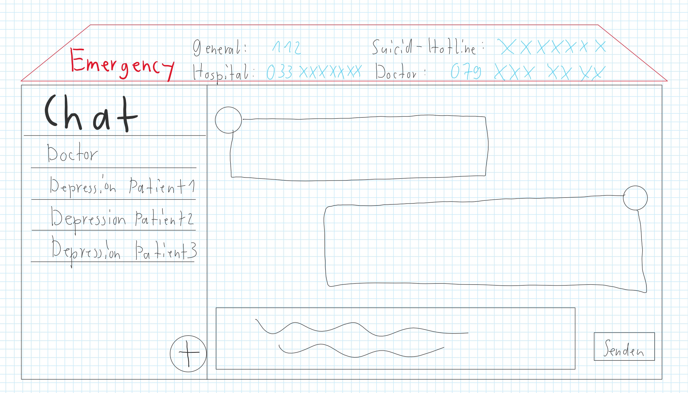
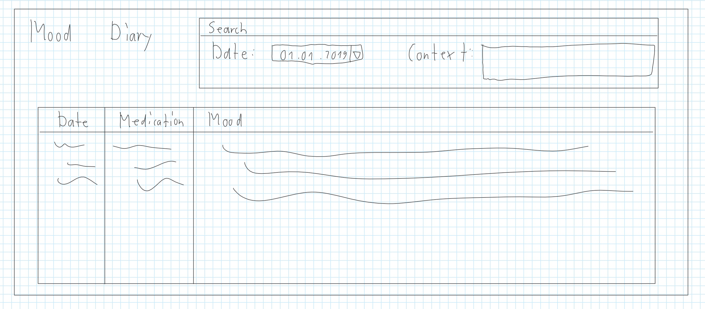
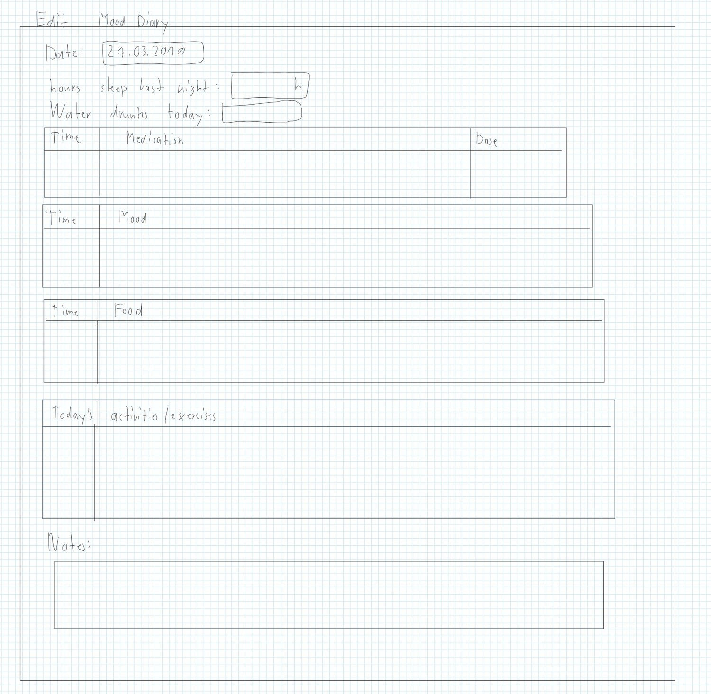
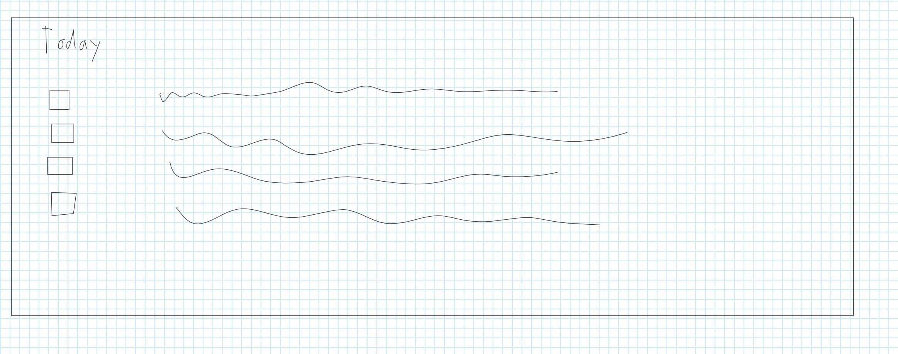
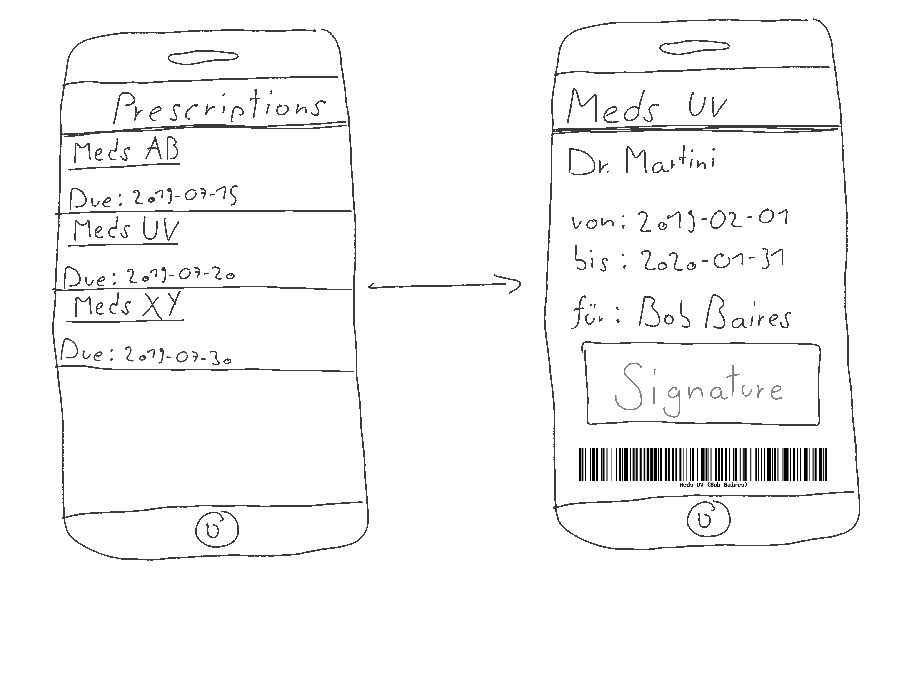

---
title: "Design Thinking"
subtitle: "Task 01 - Team Green"
author:
    - Christian Kocher
    - Fabio Caggiano
    - Marc Häsler
    - Marius Schär
    - Severin Kaderli
extra-info: false
rule-color: 00ba34
link-color: 00ba34
lang: "de-CH"
lof: true
...

# Scoping
## Unsere Aufgabe
Wir als Gruppe Grün haben die Aufgabe, eine Webapplikation aus Sicht eines (ambulanten) Patienten zu erstellen, der an Depression erkrankt ist. Dabei soll die Webapplikation schlussendlich dem Patienten helfen, alle relevanten Daten und Anforderungen an ihn besser managen zu können.

## Scope Definition
Wir haben uns folgende Stichworte zum Thema “Patient mit Depressionserkrankung” aufgeschrieben:

* Probleme
  * Suizidgefahr 
    * Notrufnummern/Hotline
  * Kein regelmässiges Einkommen
    * Öffentliche finanzielle Unterstützung
  * Mangelndes Wissen
    * Spezialist kontaktieren
    * Informationen über Probleme 
      * Suchmaschine
* Zerschlagenes familiäres Umfeld
  * Kontakte
* Therapie
  * Termine 
    * Erinnerung
    * Regelmässige Sitzung
  * Geschichte/Vergangenheit
* Medikation
  * Rezepte
* Versicherung 
  * Kostenübersicht
  * Rechnungen
* Depression 
  * Länge der Episoden > 2 Wochen
  * Symptome
    * Interessensverlust
    * Kein Selbstvertrauen
    * Schmerzen
    * Suizidgefährdet (10 – 14%)
    * Halluzinationen (selten
  * Behandlung 
    * Antidepressiva
    * Kognitives Verhalten Therapie
    * Zwischenmenschliche Therapie
* Features 
  * Medikamenten-Einnahme Erinnerung
    * Eingenommene Medikation abhaken
  * Ausgestellte Rezepte
  * Kommunikationsmöglichkeiten
    * Mit anderen Patienten (Selbsthilfe)
    * Chat mit Doktor
    * Notrufnummern-Übersicht
    * Suizid-Hotline
  * Dokumentenablage (sharing)
  * Tagebuch für den Patienten über seine Stimmung
  * Termine-Übersicht (Könnte der Patient Termine auch gleich über die App mit dem Therapeuten abmachen?)
  * Informationsseite zur Krankheit
  * Finanzielle Informationen (z.B. Versicherung)

# Research
## Informationssammlung
Die Informationen zum Thema Depression haben wir grösstenteils aus dem Interview mit [Herr Professor Florian Holsboer und der Helsana Krankenkasse](https://www.helsana.ch/de/blog/eine-depression-kann-aus-heiterem-himmel-kommen) gesammelt, um eine bessere Vorstellung der Krankheit zu bekommen. Darauf aufbauend haben wir Interviewfragen zusammengestellt, um das Patientenmanagementsystem (PMS) aus der Sicht eines (ambulanten) Patienten entwickeln zu können. 

Stichpunkte zum Thema Depression:

* Depression ist schwer zu quantifizieren, da sie nicht mit Laborwerten wie bei körperlichen Erkrankungen wie z.B. Diabetes nachweisbar ist.
* Depression wird durch winzige, unsichtbaren Mechanismen in den weitverzweigten Nervenkreisläufen des Hirns ausgelöst.
* Depression ist eine Hirnkrankheit, die einerseits aus Umwelteinflüssen wie Stress, Traumata in der Kindheit oder durch die Veranlagung der Eltern erworben werden kann. Äussere Einflüsse können auch die Aktivität unserer Gene verändern, auch Epigenetik genannt. Die DNA ist kein ruhiger Ort.
* Depression kann auch aus heiterem Himmel, was viele fälschlicherweise als Burnout bezeichnen, da diese sozialverträglicher ist.
* Man merkt, dass man eine Depression hat, wenn man ständig tieftraurig ist und sich nicht mehr an Dingen erfreut an denen man sich früher sehr wohl gefreut hat oder, wenn man sich seiner Familie und Freunden abwendet und einfach nur noch daran denkt, wie schlecht es einem geht.
* Um eine Depression diagnostizieren zu können, müssen zuerst andere Krankheiten ausgeschlossen werden, denn Antriebslosigkeit, Müdigkeit und negative Stimmung können auch von anderen Krankheiten wie Parkinson oder Alzheimer herrühren.
* Depression kann sich nicht von selbst heilen, deshalb stellt eine unzureichende oder gar keine Behandlung ein grosses Risiko für den Patienten dar. Die Depression könnte dauerhaft anhalten (Chronifizierung), was zu einer Frühinvalidität beim Patienten führen kann.
* Suizid ist eine schwere Folge der Depression. Das Abgestumpft-Sein, Nichts-mehr-Wollen, Nichts-mehr-Empfinden ist weit schlimmer als eine Operation – oder eine Krebserkrankung, laut einem Patienten, der schon all das durchgemacht hat.
* Depression ist also potenziell tödliche Krankheit, die jedes Jahr über eine Million Suizide weltweit auslöst. 
* Depressionen sollten mit Medikamenten in Kombination mit einer Gesprächstherapie behandelt werden. Die Kriterien sind bei allen Patienten gleich, nur die Ursache variiert von Patient zu Patient. Deshalb sollte jeder Patient individuell behandelt werden und die Medikamente auf den Patienten abgestimmt sein, denn nicht jedes Medikament wirkt bei jedem gleich.
* Heute ist es so, dass Psychiater aufgrund ihrer persönlichen Erfahrung und den bestimmten Symptomatiken, ein Medikament dem Patienten verschreiben. In Zukunft wird aber anhand der DNA vorausgesagt werden können, welche Medikamente den Patienten anspricht. Das ist der grosse Quantensprung in der psychiatrischen Behandlung.
* Eine Gesprächstherapie reicht vor allem bei Patienten mit schweren Depressionen nicht aus. Jeder Fünfte schwer Depressive ist nur teilweise heilbar, jeder Zehnte bleibt chronisch depressiv. Mit den heutigen Medikamenten werden zu wenig Patienten erfolgreich behandelt, da sie zu lange dauern bis sie wirken und auch zu viele Nebenwirkungen aufweisen.
* 10 – 14 Prozent erkranken der Bevölkerung erkrankt im Verlauf ihres Lebens an einer schweren Depression, dabei sind Männer und Frauen fast gleich betroffen. Es trifft vor allem die jüngeren Menschen und die Hauptursache für Frühinvalidät und Erwerbsunfähigkeit.
* Die Symptome einer Depression festzustellen ist im Gegensatz einer Knieverletzung schwieriger, weil das Gehirn erkrankt ist und man deshalb nicht gut über dessen Heilung nachsinnen kann. Wer Veränderungen spürt, sollte die die Symptome beim Hausarzt abklären lassen.
* Wenn bei einem Angehörigen Anzeichen einer Depression erkennt, sollte man ihm keinesfalls vorschlagen, auf eine schöne Reise zu gehen, da er ja seine Depression im Gepäck mitnimmt. Auch keine Vorwürfe wie «Reiss dich zusammen, dir geht’s doch gut, du hast doch alles, wieso bist du unzufrieden?» machen.
* Man sollte den jemand mit Depression offen fragen, ob ihn etwas bedrückt, da er nicht mehr so ist, wie man ihn kennt. Und ihn darauf aufmerksam machen, dass es etwas ist, das häufig vorkommt und es eine Krankheit wie jede andere ist. Dabei geht man wie bei jeder Krankheit auch zum Arzt, um nach Rat zu fragen und folgt bei Überzeugung dem Rat. Der Arzt sucht auch gleich das passende Therapieschema und die passende Medikation in Verbindung einer Gesprächstherapie.

## Interview 1
**Interviewpartner:** Chantal Gerber  
**Datum:** 2019-03-26  
**Ort:** Heimberg

### Neue Patienten
#### Wie und wann werden Daten eines Patienten gespeichert?
> Das meiste wird elektronisch gespeichert. Während den Sitzungen werden 
> jedoch Notizen meistens manuell auf Papier erstellt.

#### Welche Informationen werden von einem neuen Patienten benötigt?
> * Name
> * Alter
> * Zivilstand
> * Beruf
> * Diagnose

#### Wie läuft eine erste Begutachtung eines Patienten ab?
> * Befragung des Patienten durch Fragen über Stressverhalten und Befinden
> * Frage nach der Orientierung des Patienten (Zeitlich, Räumlich)

### Vorbereitung auf einen Termin
#### Wie bereitet sich ein Therapeut auf einen Termin mit einem Patienten vor?
> 1. Krankenakte des Patienten anschauen
> 2. Letztes Gespräch / Informationen nachschauen
> 3. Notizen für neue Sitzung vorbereiten (Fragen, Nächste Schritte)

#### Wie bereitet sich ein Patient auf den Termin vor, was wird von ihm verlangt?
> Er sollte sich nicht speziell vorbereiten und einfach zur Sitzung gehen. 
> Er soll einfach von seinen Problemen / Ängsten zu reden.

#### Wie machen Patienten Termine mit dem Therapeuten aus (Telefon, Mail, Online-Formular)?
> Am Ende einer Sitzung wird normalerweise direkt der nächste Termin ausgemacht.

#### Haben Patienten Mühe, Termine einzuhalten?
Warum haben sie Mühe?

> Sie schämen sich

Wie könnte man Helfen, dass sie keine Mühe mehr haben?

> Begleitung durch Anruf oder SMS, damit immer ein Therapeut vorhanden ist.

### Während dem Termin
#### Was sind die zu erwartenden Resultate eines Gesprächs?
Was für Dokumentationen werden geführt (pers. Journal, Krankenakte/Patientendossier)?

> Es wird eine Krankenakte für den Patienten geführt. Je nach Situation
> wird auch mit dem Patienten zusammen ein Plan erstellt.
 
Gibt es Anforderungen an die Art und Weise einer Dokumentation?

> Die Dokumentation muss objektiv und nicht wertend geschrieben werden.

Irgendwelche Anhänge wie Bilder/Audioaufnahmen/Video die erstellt werden?

> Je nach Situation kann das nützlich sein. Vorallem Audioaufnahmen werden
> von Zeit zu Zeit verwendet.

Gibt es eine strukturierte Vorgabe oder beruht alles auf Freitext?

> Meistens gibt es Vorgaben.

Darf der Patient Einblicke in die erstellte Dokumentation haben?

> Ja, das darf er.

### Behandlungsablauf des Patienten
#### Auf was für Informationsquellen werden zugegriffen, um eine Diagnose zu erstellen?
Wer meldete den Patienten?

> Normalerweise wird der Patient vom Hausarzt überwiesen oder der
> Patient meldet sich selber.

Wie wird es dokumentiert?

> Durch ein Überweisungsschreiben.
  
#### Wie werden Behandlungen ausgewählt und Erfolge überprüft?
Welche Faktoren sind relevant für die Dosierung/Rythmus einer Medikation?

> Der Hauptfaktor ist der Schweregrad der Diagnose und ob es am morgen
> oder am Abend die meisten Beschwerden gibt. Zudem wird zuerst mit einer
> kleineren Dosis gestartet um zu sehen wie die Medikation anschlägt. 

Wie werden Daten zum Erfolg der Behandlung zusammengetragen?

> Die Dokumentation wird fortlaufen weitergeführt und anhand vom Verlauf
> kann man die Resultate ablesen.

### Zur Patienten-App
#### Was ist Ihre Meinung zu den folgenden Features des Patienten-Apps?
* Medikamenten-Einnahme Erinnerung
    * Eingenommene Medikation abhaken

      > Super, sehr hilfreich für junge (vergessliche) Patienten
* Ausgestellte Rezepte
  
  > Gut
* Kommunikationsmöglichkeiten
    * Mit anderen Patienten (Selbsthilfe)
  
      > Gut, wenn erwünscht von Patient
    * Chat mit Doktor
  
      > Gut, evtl. mit Medgate Zugang
    * Notrufnummern-Übersicht
  
      > Gut
    * Suizid-Hotline
  
      > Gut
* Dokumentenablage (sharing)

  > Gut
* Tagebuch für den Patienten über seine Stimmung

  > Gut
* Termine-Übersicht (Könnte der Patient Termine auch gleich über die App mit dem Therapeuten abmachen?)

  > Gut
* Informationsseite zur Krankheit

  > Gut, kommt auf den Patienten an, manche haben Probleme, wenn sie ihre
  > Krankheit besser kennen.
* Finanzielle Informationen (z.B. Versicherung)

  > Gut

# Synthesize

## Persona: Mallorie Picconie (24)

- Job: Cyber Security Expert
- Civil Status: Single
- Residence: Bern
- Hobbies: Hackathons, Reddit, Post eVoting
- Medical History: Since Childhood, Unipolar, Moderate impact on life

Mallorie has depression due to genetic factors, and is diagnosed since childhood.
Mallorie studied computer science and now works at BACOM.
She moved out from home a few years ago and now lives alone.
In her free time, she likes to talk about cybersecurity online with other enthusiasts,
and likes to participate in hackathons.  
She was diagnosed with depression at 12 years old and has been in treatment since.
She wants to keep her treatment going, so that her depression continues
not to impact her life too much.

## Persona: Bob Baires (50)

- Job: Banker (Previously)
- Civil Status: Married (2x), 1 child
- Residence: Zürich
- Hobbies: Golf, Poker, spending time with his wife and son
- Medical History: Since 6 months (triggered by a traumatic event), Unipolar, Heavy impact on life

Bob had had a fullfilling life, doing what he loved.
He was successful early on in his career.
He married his first wife at 22, altough she left him 2 years later.
He met another woman and married her soon after.
They had a son together and lived happily.
At 49 Bob experienced a traumatic event in his life, which triggered his depression.
Due to an error on his part he lost a lot of money and got fired from his job.
Although Bob was now unable to work, their family was fine thanks to
savings and his wife still working.
Bob only recently entered therapy and has not yet settled into his new life.
He hopes to get to a point where he can enjoy life with his family again,
and possibly even work.

# Design
## Storyboards Fabio Caggiano

## Storyboards Christian Kocher
## Storbyboards Marc Häsler

## Storbyboards Marius Schär

## Storbyboards Severin Kaderli

# Prototype

# Validate
