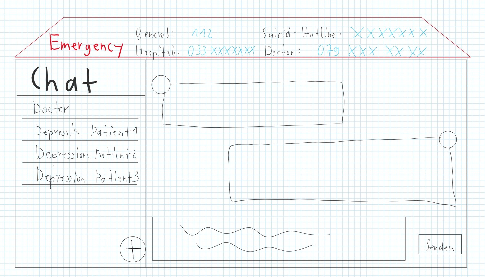
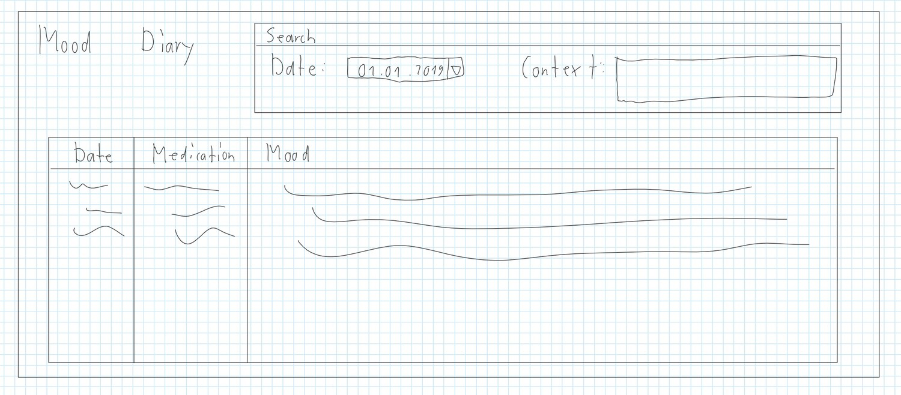

---
title: "Design Thinking"
subtitle: "Task 01 - Team Green"
author:
    - Christian Kocher
    - Fabio Caggiano
    - Marc Häsler
    - Marius Schär
    - Severin Kaderli
extra-info: false
rule-color: 00ba34
link-color: 00ba34
lang: "en"
aspectratio: 169
header-includes: |
    \newcommand{\colsbegin}{\begin{columns}}
    \newcommand{\colsend}{\end{columns}}
    \def\col#1{\column{.#1\textwidth}}
...

# Scoping

## Aufgabe

- Ambulant patient
- With depression
- Webapp

## Depression

- Episodes longer than 2 weeks
- Symptoms
  * Loss of interest
  * Loss of confidence
  * Pain
  * Suicide
- Treatment
  * Anti-Depressants
  * Cognitive Behavioral Therapy (CBT)
  * InterPersonal Psychotherapy (IPT)

# Research

# Synthesize

## Persona: Mallorie Picconie (24)
\colsbegin
\col{40}

{ width=60% }

- Job: Cyber Security Expert
- Civil Status: Single
- Residence: Bern
- Hobbies: Hackathons, Reddit, Post eVoting
- Medical History: Since Childhood, Unipolar, Moderate impact on life

\col{60}

> Mallorie has depression due to genetic factors, and is diagnosed since childhood.
> Mallorie studied computer science and now works at BACOM.
> She moved out from home a few years ago and now lives alone.
> In her free time, she likes to talk about cybersecurity online with other
> enthusiasts, and likes to participate in hackathons.
> She was diagnosed with depression at 12 years old and has been in treatment since.
> She wants to keep her treatment going, so that her depression continues
> not to impact her life too much.

\colsend

## Persona: Bob Baires (50)
\colsbegin
\col{40}

{ width=60% }

- Job: Banker (Previously)
- Civil Status: Married (2x), 1 child
- Residence: Zürich
- Hobbies: Golf, Poker, spending time with his wife and son
- Medical History: Since 6 months (triggered by a traumatic event), Unipolar, Heavy impact on life

\col{60}

Bob had had a fullfilling life, doing what he loved.
He was successful early on in his career.
He married his first wife at 22, altough she left him 2 years later.
He met another woman and married her soon after.
They had a son together and lived happily.
At 49 Bob experienced a traumatic event in his life, which triggered his depression.
Due to an error on his part he lost a lot of money and got fired from his job.
Although Bob was now unable to work, their family was fine thanks to
savings and his wife still working.
Bob only recently entered therapy and has not yet settled into his new life.
He hopes to get to a point where he can enjoy life with his family again,
and possibly even work.

\colsend

# Design

# Prototype

## Communication

## Mood Diary

## Mood Diary

## Medication Reminders

## Picking up Prescription

# Validate
