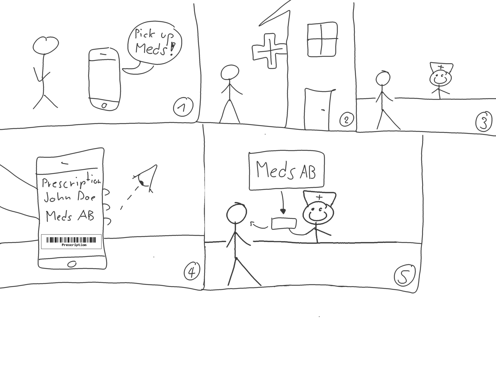
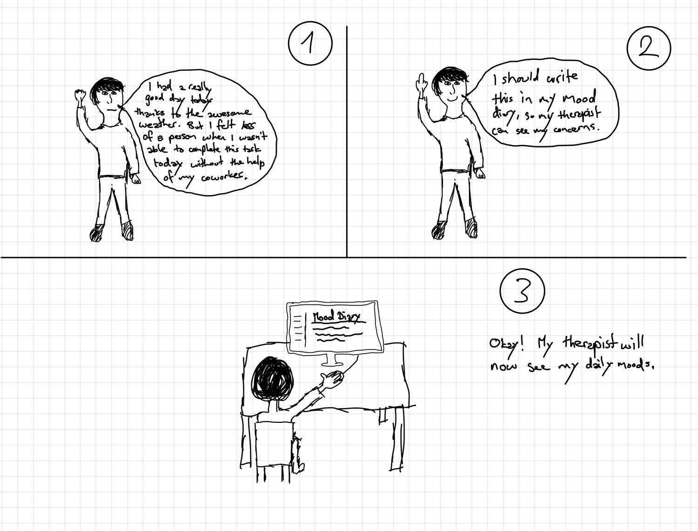
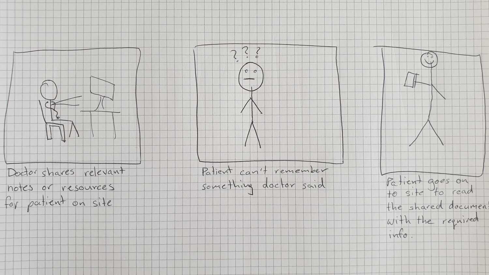
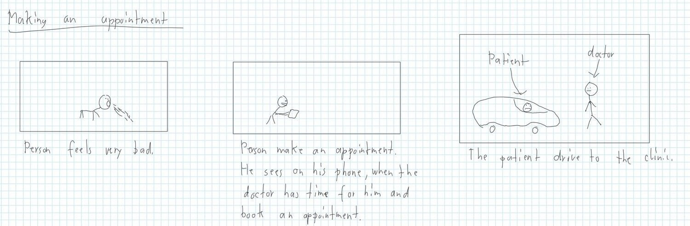
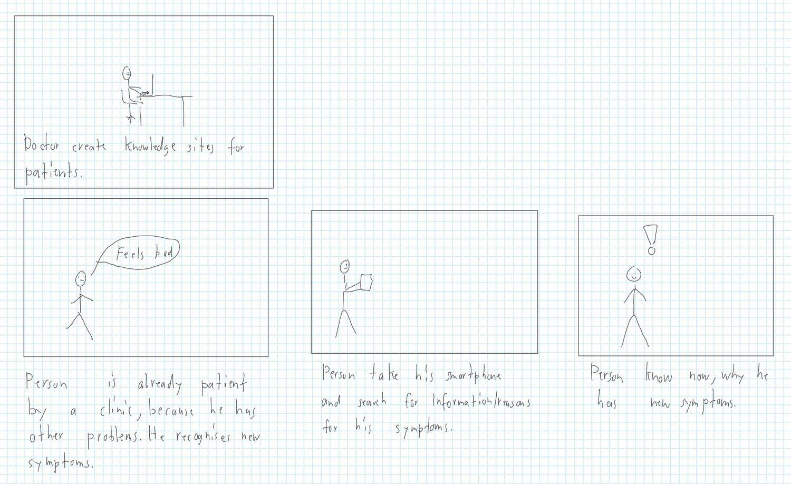
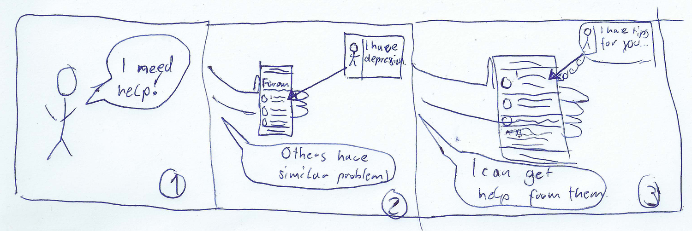
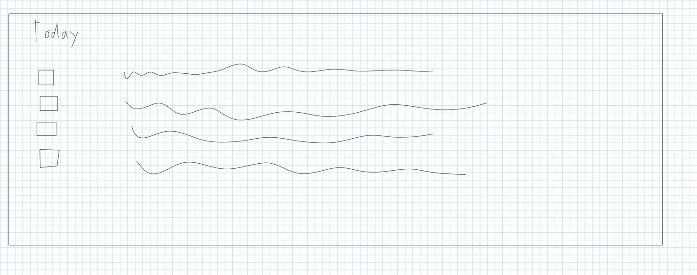
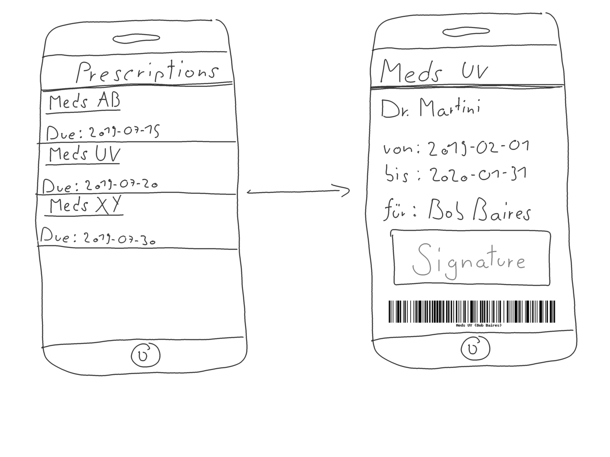

---
title: "Design Thinking"
subtitle: "Task 01 - Team Green"
author:
    - Christian Kocher
    - Fabio Caggiano
    - Marc Häsler
    - Marius Schär
    - Severin Kaderli
extra-info: false
rule-color: 00ba34
link-color: 00ba34
lang: "en"
aspectratio: 169
header-includes: |
    \newcommand{\colsbegin}{\begin{columns}}
    \newcommand{\colsend}{\end{columns}}
    \def\col#1{\column{.#1\textwidth}}
...

# Scoping

## Aufgabe

- Ambulant patient
- With depression
- Webapp

## Depression

- Episodes longer than 2 weeks
- Symptoms
  * Loss of interest
  * Loss of confidence
  * Pain
  * Suicide
- Treatment
  * Anti-Depressants
  * Cognitive Behavioral Therapy (CBT)
  * InterPersonal Psychotherapy (IPT)

# Research

## Research
- Interview with a Professor of Psychiatry by Helsana Health Insurance
- Interviews with healthcare professionals (2x)
- Wikipedia Articles on
  * Major Depressive Disorder
  * Management of Depresseion

# Synthesize

## Persona: Mallorie Picconie (24)
\colsbegin
\col{40}

\centering

\col{60}

- Job: Cyber Security Expert
- CivStat: Single
- Residence: Bern
- Hobbies: Hackathons, Reddit
- Medical History: Since Childhood, Unipolar, Moderate impact on life

\colsend

## Persona: Bob Baires (50)
\colsbegin
\col{40}

\col{60}
- Job: Banker (Previously)
- CivStat: Married (2x), 1 child
- Residence: Zürich
- Hobbies: Golf, Poker, Family
- Medical History: Since 6 months, Unipolar, Heavy impact on life

\colsend

## Features
\colsbegin
\col{50}

- Medication Reminders
  * Tick off ingested medication
- Picking up Prescriptions
- Mood Diary
- Financial Information (Insurance)
- Communication
  - Emergency Numbers
  - Suicide Hotline
  - with doctor

\col{50}

- Document sharing
- Appointments
- Information Page
- Communication
  - with other patients (self help)

\colsend

# Design
## Medication Reminder

## Pick up Prescription

## Mood Diary

## Show Invoices

## Emergency Contact

## Sharing Documents

## Making an appointment

## Information Page

## Communication with other Patients

## Communication with Health Care Profesisonal

# Prototype

## Communication

## Mood Diary (I)

## Mood Diary (II)

## Medication Reminders

## Picking up Prescription

# Validate

## Validate

### Methodology

- Interview partners
- Prototypes

### Findings

- The basic concept holds up
- Medication Reminders & Chat system
- Permissions from the doctor (patient-patient chat)
- Good Inputs
  - Mood rating system
  - Quick status check of patient
