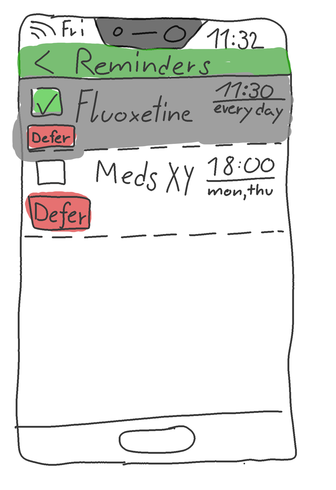

---
title: "Requirements Specification"
subtitle: "Task 02 - Team Green"
author:
    - Christian Kocher
    - Fabio Caggiano
    - Marc Häsler
    - Marius Schär
    - Severin Kaderli
rule-color: 00ba34
link-color: 00ba34
lof: true
lot: true
glossary: true
glossary-file: "assets/glossary.tex"
...

# Preface
This document is for system engineers, end-users,
system administrator and managers which
are involved in the project.

## History
: History

| Version | Author          | Changelog                    | Date       |
| :-----: | --------------- | ---------------------------- | ---------- |
|   0.1   | All             | Document created             | 2019-03-27 |
|   0.2   | Severin Kaderli | Add glossary and testing     | 2019-04-03 |
|   0.3   | Fabio Caggiano  | Add system model & evolution | 2019-04-04 |
|   0.4   | C. Kocher       | Added Introduction           | 2019-04-05 |
|   0.5   | C. Kocher       | Added System Architecture    | 2019-04-05 |
|   0.6   | C. Kocher       | Added System Requirements    | 2019-04-05 |
|   0.7   | MS              | Added Use-Cases              | 2019-04-07 |

\newpage
# Introduction

This document describes the requirements for software that supports patients with
depression in therapy as well as doctors in their day-to-day work with their 
patients.

Our goal is to develop an application which allows for doctors and patients with
depression to work closely together. The software is to provide assistance to the
patient where needed and allow the doctors to grant access to information and help 
where appropriate.
Individuals suffering from depression should be able to have a source
of information and help at their fingertips when they require it.

The application's functions will be on a "permission" basis determined by the 
patient's doctor. This means that the doctor will be able to decide which functions 
are most helpful to his patients and which are not suited to certain cases.

The doctor will be able to track a patient's progress through the system and monitor 
any changes.

The idea is to allow for a cooperative process between doctor and patient. It is not
intended to replace any systems already in place but to support them, especially from
the point of view of the patient.

The application should help to support a patient by allowing them to write mood diaries,
keep track of medication intake and prescriptions, contact their doctor for help and
advice and provide information and emergency contacts. These are all things which, 
according to our interviewees, can help a person suffering from depression in their 
day-to-day lives.

: Roles

| Initial | Name             | Role                   |
| :-----: | ---------------- | ---------------------- |
|   CK    | Christian Kocher | Student / Developer    |
|   FC    | Fabio Caggiano   | Student / Developer    |
|   MH    | Marc Häsler      | Student / Developer    |
|   MS    | Marius Schär     | Student / Developer    |
|   SK    | Severin Kaderli  | Student / Developer    |
|   JV    | Jürgen Vogel     | Lecturer / Stakeholder |
|   UK    | Urs Künzler      | Lecturer / Stakeholder |

# User requirements definition
In this section we flesh out the use cases that we got especially good feedback
on during the interviews.

\newpage

## Use-Cases
### 001 - Medication Reminders
----------------------- --------------------------------------------------------
**No.:**                001

**Name:**               Medication Reminders

**Short Description:**  The patient takes their medication when reminded
                        by the system at the time that the therapist specified
                        and ticks it off when taken.

**Scenario A:**         Bob's Therapist prescribed him Fluoxetine to
                        take daily before noon.
                        The therapist entered these data into the PMS.
                        Everyday at 11:30 Bob's devices buzz to remind
                        him to take his medication.
                        After he takes it,
                        Bob checks off on his device
                        that he has taken the medication.

**Variant A.1:**        Today Bob cannot take his medication when his device
                        reminds him because he is driving.
                        The system automatically defers his reminder
                        by 30 minutes for today and reminds him again then.

**Involved Actors:**    Patient, Therapist, System

**Pre-Condition:**      Patient has medication assigned by therapist.

**Result:**             Patient is reminded about medication and takes it.

**Post-Condition:**     Patient has taken medication, the system knows about it.

**Side-Effects:**       -

--------------------------------------------------------------------------------

: Use-Case 001: Medication Reminders

\newpage

#### Steps

--------------------------------------------------------------------------------
  **No.** **Involved**         **Description**
--------- -------------------- -------------------------------------------------
        1  Therapist,           The therapist prescribes medication to the
           Patient              patient and when to take it.

        2  Patient,             The system reminds the patient to take their
           System               prescribed medication at the correct time.

      3.A  Patient,             The patient takes the medication and checks it
           System               off in the system.

      3.B  Patient,             The patient notices the system, but cannot take
           System               the medication right now. He tells the system
                                to defer the reminder until later.

      3.C  Patient,             The patient doesn't notice the system, or
           System               can't interact with it for another reason.
                                The system automatically defers the reminder.
--------------------------------------------------------------------------------

\newpage

#### Activity Diagram
{ height=80% }

\newpage

#### Exception UC.001.E.1
As described in *UC.001.A.1* the patient may not be able to take their medication
when the system reminds them to.  
In this case, the patient can tell the system to "defer" the reminder.
The system will then remind the patient at a later date.

#### Exception UC.001.E.2
Similar to *UC.001.E.1*, but the patient may not be able to interact with
the system, for example if they were driving.  
If the patient does not interact with the system for 10 minutes after
it reminded them, the system will automatically defer the reminder for
some time. The patient will be reminded again after that time has passed.
The time for which to defer a reminder should be set by the therapist,
because some medication may be time-sensitive.

\newpage

#### Prototype UC.001.P.1
This prototype is more detailed than the one in the last phase.
It shows the defer-mechanism, as well as a more structured UI.

\newpage

### 002 - Patient-Therapist Communication
----------------------- --------------------------------------------------------
**No.:**                002

**Name:**               Patient-Therapist Communication

**Short Description:**  The patient wants to talk to their therapist
                        and can do this quickly and asynchronously.

**Scenario:**           Mallorie wants to talk to her therapist about some
                        symptoms she's been experiencing.
                        Through a text interface they can communicate
                        quickly and asynchronously to discuss if and what
                        further steps should be taken in order to mitigate
                        Mallorie's symptoms.
                        The therapist asks Mallorie to keep an eye on her mood
                        in the coming days and report it to him.

**Involved Actors:**    Patient, Therapist

**Pre-Condition:**      Patient wants to talk to their therapist.
                        OR\
                        Therapist wants to talk to their patient.

**Result:**             The patient and therapist communicated.

**Post-Condition:**     -

**Side-Effects:**       -

----------------------- --------------------------------------------------------

: Use-Case 002: Patient-Therapist Communication

\newpage

### 003 - Mood Diary
----------------------- --------------------------------------------------------
**No.:**                003

**Name:**               Mood Diary    

**Short Description:**  The patient can record their mood, activity, sleep,
                        and food for any given date
                        and share this information with their therapist.
                        
**Scenario:**           Her therapist has asked Mallorie to record her mood
                        for two weeks in order to better gauge the success
                        of a new medication.\
                        Every evening, Mallorie rates how she felt today,
                        writes down what she did, what she ate, how she slept
                        and any other significant occurences.\
                        Her therapist sees this information and can
                        adjust her dosage relatively quickly.

**Involved Actors:**    Patient

**Pre-Condition:**      Therapist asks patient to track their mood.

**Result:**             Therapist and patient see the progress of the patient.

**Post-Condition:**     -

**Side-Effects:**       It may be detrimental for some patients to have to write
                        down how they feel. Thus the therapist should have to
                        enable the feature for the patient.

----------------------- --------------------------------------------------------

: Use-Case 003: Mood Diary

\newpage

#### Steps

-------------------------------------------------------------------------
  **No.** **Involved**  **Description**
--------- ------------- -------------------------------------------------
        1 Patient       Patient opens the mood diary UI.

        2 Patient       Patient rates their overall mood on a quick
                        scale (See Prototype UC.003.P.1)

      3.A Patient       If the patient rates their mood positively
                        on the quick scale, all further inputs are
                        optional

      3.B Patient       The patient is asked how much they slept
                        last night.

        4 Patient       The patient is asked how much water they drank
                        today.

        5 Patient       The patient is asked what medication they took
                        today. This is pre-filled from the medication
                        that the system knows about.

        6 Patient       The patient is asked what they ate today.

        7 Patient       The patient is asked about any significant
                        mood changes during the day.

        8 Patient       The patient is asked about any activities or
                        exercise they did today.

        9 Patient       The patient can enter any general notes that
                        they want the therapist to know, but didn't fit
                        any of the previous categories.
-------------------------------------------------------------------------

\newpage

#### Exception UC.003.E.1
It's detrimental to the patient to spell out how they feel,
or to see that they're not making the desired progress in their therapy.

**Attention**

The desired solution to this problem has to be decided.

#### Exception UC.003.E.2
The patient forgets aspects of their day and fills them out inaccurately.
This generates false data and may hinder the therapist in their decision
making process

\newpage

#### Prototype UC.003.P.1
This is an updated prototype for "Mood Diary Part 2", the most significant
change is the inclusion of a quick rating system at the top.

\newpage

### 004 - Emergency Contacts
----------------------- --------------------------------------------------------
**No.:**                004

**Name:**               Emergency Contacts

**Short Description:**  The patient has quick access to a number of emergency
                        contacts, such as: A suicide hotline, their therapist,
                        some close family members.\
                        It should be **obvious** how to reach the emergency
                        contacts from any point in the application
                        
**Scenario:**           Bob is experiencing a particularly heavy episode of
                        depression. He wants to talk to his therapist
                        immediately. He selects his contact details in the PMS
                        and his phone automatically opens the phone app to call
                        the therapist.

**Involved Actors:**    Patient, Therapist/3rd Party

**Pre-Condition:**      Patient wants to urgently communicate with someone.

**Result:**             An appropriate communications channel is opened, and
                        the patient can talk to the selected party.

**Post-Condition:**     -

**Side-Effects:**       -

----------------------- --------------------------------------------------------

: Use-Case 004: Emergency Contacts

#### Exception UC.004.E.1
The selected party is not reachable at this time, the PMS should suggest
an alternative party to contact, such as a close family member.

\newpage

# System architecture

## Client
A user of the system will access the application through a web-browser
on their client device. All requests to the server will be made over an
encrypted connection using HTTPS (SSL/TLS).

## Web Server
The web server will handle requests to and from the client. This server will 
communicate directly with the application server allowing for data to be 
passed back and forth.

## Application Server
The application server will handle all requests and data 
which do not involve the user interface. All business logic,
authentication and database queries are executed here. 

## Database
User information, patient information and all other required data will be 
stored in the database. It is of utmost importance that the information stored
and being sent to and from the database is extremely secure. The database will
contain very sensitive patient information and all the users authentication 
information.

# System requirements

## Functional System Requirements

### User Administration
The system should allow for user management through an admin login. Here the
system administrator will be able to add, remove and edit existing users. The
system administrator will also be able to edit any available settings from here.

### Login and Dashboard
A user should be able to log into his/her account and have an overview of their
profile. The user should be able to configure their profile wherever possible.
This includes updating personal information and authentication details.

### Patient Management
A doctor should be able to login and have an overview of his/her patients.
A doctor should also be able to set certain permissions for patients.

### Saving Data and Documents
The system should allow all users to save relevant information and documents 
to a database.
The information stored should be secure and only visible to users with the 
correct permissions.

## Non-Functional System Requirements

### Usability
The application should be self-explanatory to use and it should be easy and clear 
to navigate. Important information and links should stand out on the individual
pages. Emergency numbers should be displayed clearly on all pages.

### Availability
The application should be accessible and usable at all times.

### Security
All information sent to and from the server should be secure and encrypted.
The data stored in the database should not be accessible by any third party.

### Performance
The system should offer consistently high performance. This means pages and
data should be loaded in less than 2 seconds.

### Stability
The application should remain stable. A user should never be interrupted 
while on the site and data should never be lost due to faults in the application.

# System models

To following data-flow-diagram describes the interaction of different system components from the patient's perspective in the patient management system.

You can read the above diagram like this: The patient enters the login details, the application server queries the database (patient table) if the right login credentials have been provided and either informs the patient that the username or password were invalid or forwards the patient to the main page of the application. From the main page, the user has the possibility to open the communication, mood diary, medication reminder or prescription overview tab. Each one of these features retrieve and write data to their corresponding database table.

# System evolution

After the development of this web application, patients should have all fundamental features to manage their data. For the time being there are no new features planned. However, new features requested by our customer could be integrated without any problems in the future because our development team preferably strives to write good structered generic code. 

With growing patient data and workloads in the future, the hardware can be enhanced with load balancers for example to coordinate traffic and more servers to distribute the databases and link them together.

# Testing
This application is meticulously tested using the following methods.

## Component Tests
The code of the application is gonna be tested using numerous methods including
unit tests by the individual developers and code reviews. This way a high
software quality can be ensured.

## Integration Tests
To ensure all components are behaving correctly together they are thoroughly
tested before deploying a new version.

## System Tests
After the aforementioned integration tests the result is compared agains the
specification to ensure that the requirements and functionality are correctly
implemented and working.

## Validation Tests
At the end of the project the application is tested together with the customer.
This way it can be ensured the software is behaving exactly like the customer
wants and that the user experience is acceptable

# Appendices
 * System requirement
   * User:
     * Devices with internet connection (Computer, Tablet, Phone)
     * Browser for example Firefox, Safari, Chrome
   * Server:
     * Enough space for data
     * Enough performance (Ram Memory, Processor)
     * Reliable and fast internet connection 
