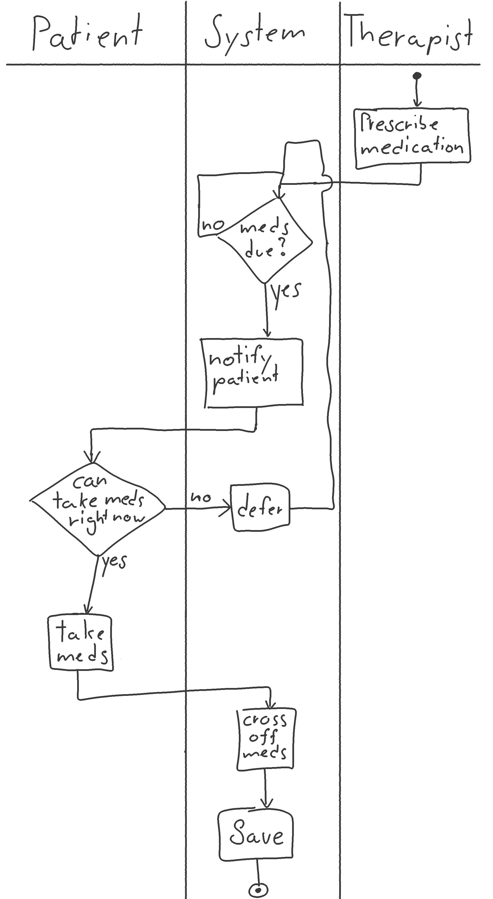
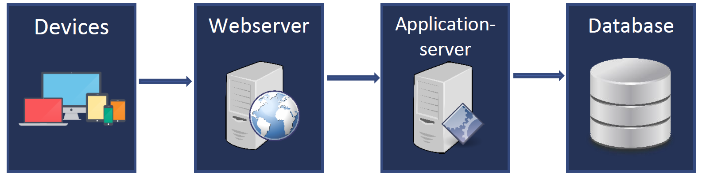
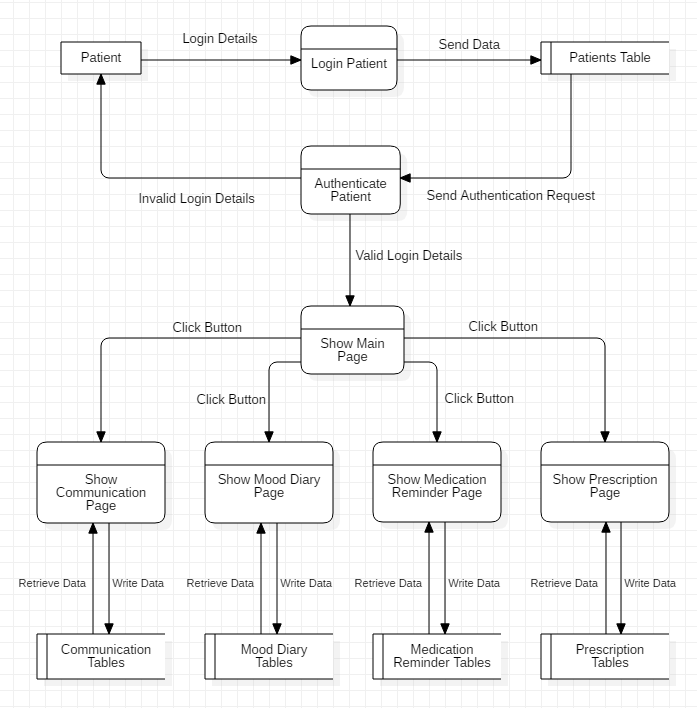

---
title: "Requirements Specification"
subtitle: "Task 02 - Team Green"
author:
    - Christian Kocher
    - Fabio Caggiano
    - Marc Häsler
    - Marius Schär
    - Severin Kaderli
main-color: 00ba34
lang: "en"
...

# Introduction

- Support patients suffering from depression
- Allows doctors and patients to work closely together
- Not intended to replace existing systems
- Support

# User Requirements

## Use-Cases

## Use-Case 001
\colsbegin
\col{40}

\centering

\col{60}
- Medication Reminders for Bob
- Used to remind patients to take their medications
- User is required to tick off the medication taken
- Exception might be that the user cannot take meds

\colsend

## Activity Diagram

\centering
{ height=75% }

## Prototype

# System Architecture

## System Architecture

\centering

# System Requirements

## Functional Requirements

- User Administration
- Login and Dashboard
- Patient Management
- Saving Data and Documents

## Non-Functional Requirements

- Usability
- Availability
- Security
- Performance
- Stability

# System models

\centering

# System evolution

- New features $\rightarrow$ No problem, because of a well structured, generic codebase
- Scalability  $\rightarrow$ Load balancing and distributed database for increased traffic

# Testing
This application is meticulously tested using the following methods.

- Component Tests
  * Unit Tests
  * Code Reviews

- Integration Tests
  * Each component gets tested thoroughly before deploying a new version

- System Tests
  * Compare results with specification
  * Test requirements and functionalities if correctly implemented and working

- Validation Tests
  * Test the end application together with customer
  * Make sure functionalities and user experience meet customer's expectations

# Appendices

   - User Requirements:
     * Devices with internet connection (Computer, Tablet, Phone)
     * Browser for example Firefox, Safari, Chrome
   - System Requirements:
     * Enough space for data
     * Enough performance (Ram Memory, Processor)
     * Reliable and fast internet connection 

# Questions?

# Thank you!
