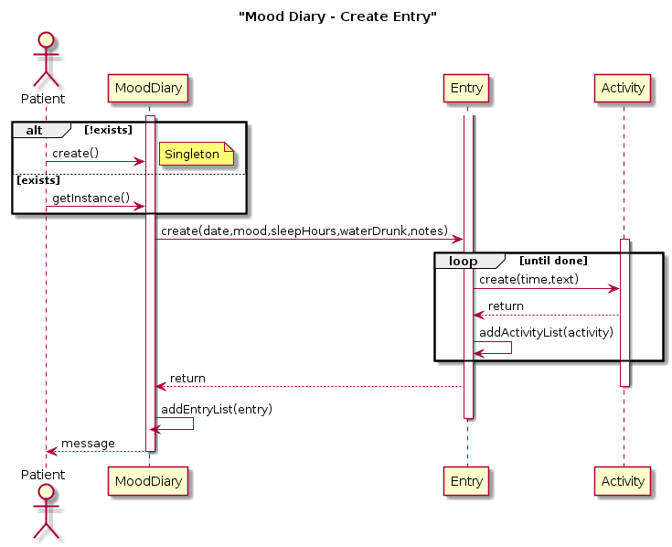

---
title: "Domain Model and Sequence Diagram"
subtitle: "Task 04 - Team Green"
author:
    - Christian Kocher
    - Fabio Caggiano
    - Marc Häsler
    - Marius Schär
    - Severin Kaderli
rule-color: 00ba34
link-color: 00ba34
lof: true
lot: true
...

# Domain Model

Our domain model is based on Responsive Driven Design, which helps encapsulating our objects better. We have the classes "Patient" and "Therapist" who inherit directly from the "Person" class. In order to implement a chat system in the application, the classes "Contact" "Message" and "Channel" are strongly linked to the "Person" class. A patient has a therapist who takes care of him and a bunch of emergency contacts. Furthermore, a patient is provided with some functions to manage his requirements like a reminder on when to take in his medication, which again is handled by the "Prescription" class. Moreover, the patient is able to edit his mood diary by creating entries with different activities per entry.

{ height=75% }

# Sequence Diagrams

## Mood Diary

This sequence diagram shows the process of creating an entry in the mood diary. First it will be checked if a mood diary instance already exists. If yes, we get the instance or else we create a new one. Then we create a new entry with a date, mood enumeration from 1 to 5, how many ours the patient slept, how much water he drunk and with optional notes. After that, as many activity objects as wanted can be created with a time and a text as parameters. The activity object(s) are then added to the to the entry's object activity list and the entry object added to the mood diary's entry list. At the end, the patient receives a message.

{ height=75% }

## Prescription Reminder

This sequence diagram shows the process of how the patient is reminded to take in medication via the prescription from the therapist. The therapist creates a prescription, the prescription is added to the reminder object which calculates the reminder recurrence. When time is up, the patient will be asked to decide to delay the reminder which would consequently calculate a new reminder recurrence or deactivate it. 

{ height=75% }

# Extended Domain Model

We extended our domain model by methods described in the sequence diagrams.

{ height=75% }