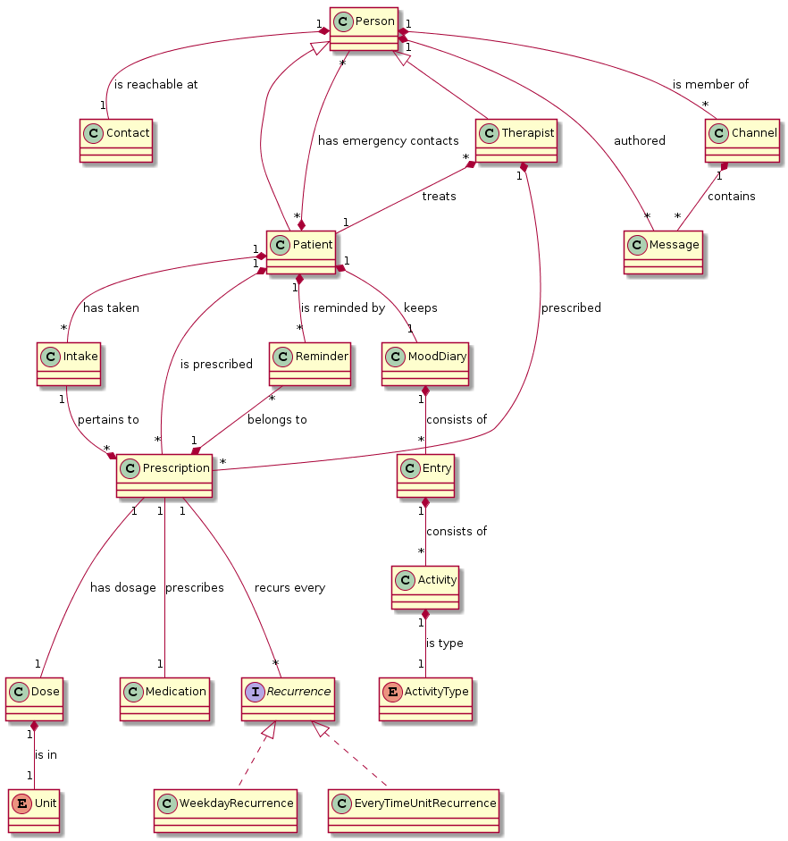
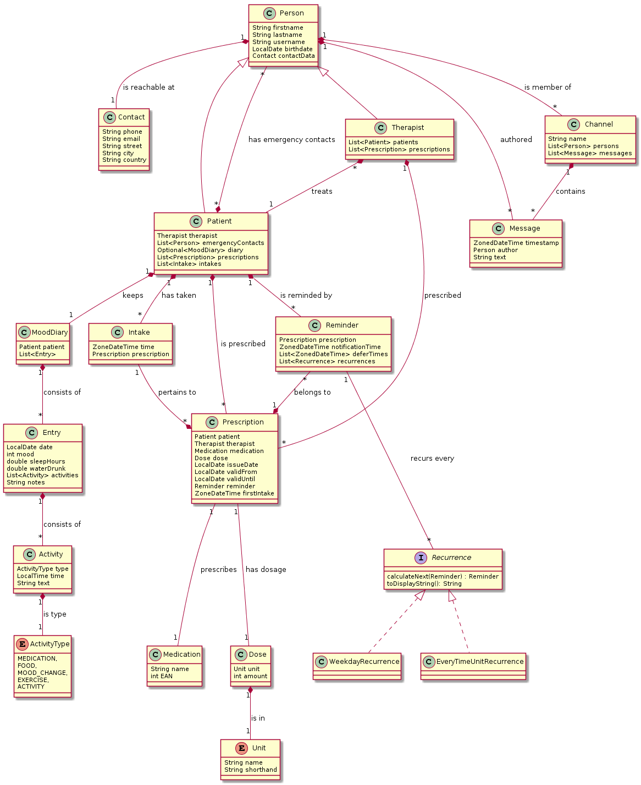

---
title: "Domain Model and Sequence Diagram"
subtitle: "Task 04 - Team Green"
author:
    - Christian Kocher
    - Fabio Caggiano
    - Marc Häsler
    - Marius Schär
    - Severin Kaderli
main-color: 00ba34
lang: "en"
...

# Introduction (Reminder)

- Support patients suffering from depression
- Allows doctors and patients to work closely together

# Domain Model
{ height=75% }

# Sequence Diagrams
## Mood Diary
{ height=75% }

## Prescription Reminder
{ height=75% }

# Extended Domain Model
{ height=75% }
