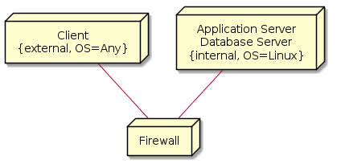

---
title: "Architecture"
subtitle: "Task 05 - Team Green"
author:
    - Christian Kocher
    - Fabio Caggiano
    - Marc Häsler
    - Marius Schär
    - Severin Kaderli
rule-color: 00ba34
link-color: 00ba34
lof: true
lot: true
...

# Component Diagram

# Deployment Diagram

# Class Diagram for Mood Diary View

The MoodDiaryViewImpl class implements the MoodDiaryView interface and
additionally extends the UI classes from the Vaadin framework. Furthermore, the
MoodDiaryPresenter implements all methods from the MoodDiaryViewListener with
the result that the view can communicate with the MoodDiaryManager model. The
MoodDiaryManager class is responsible for querying the database via the Java
Persistence API (JPA).

